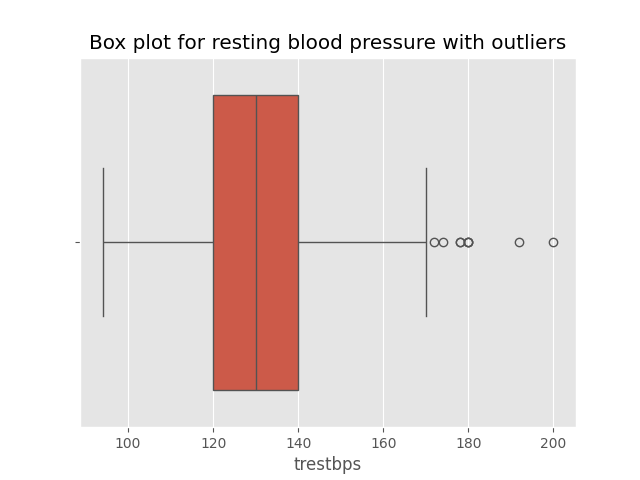
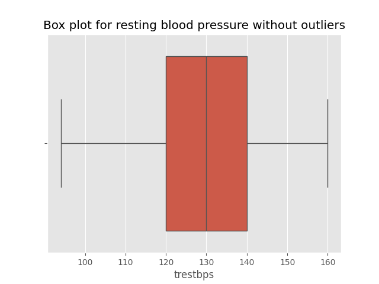
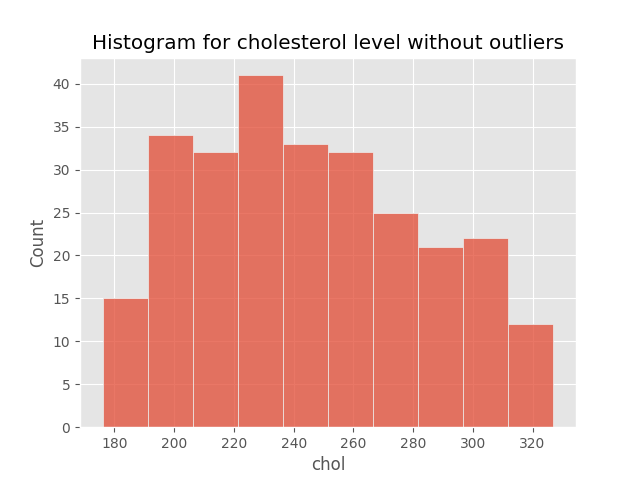
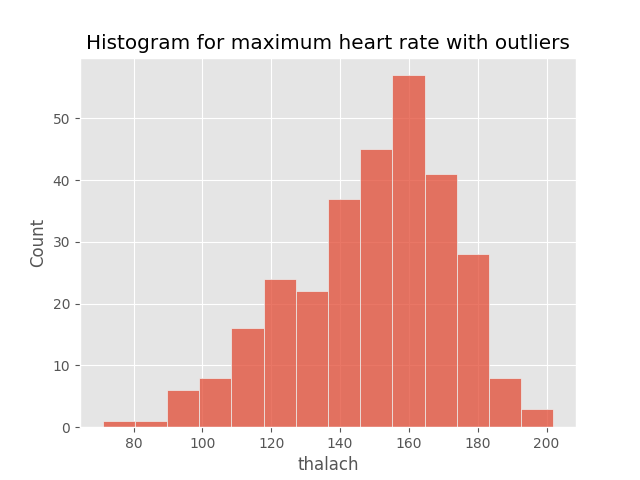
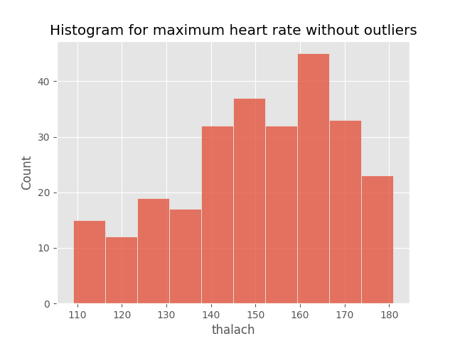
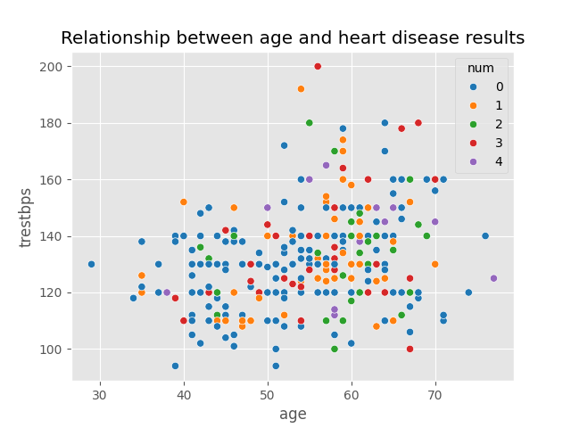
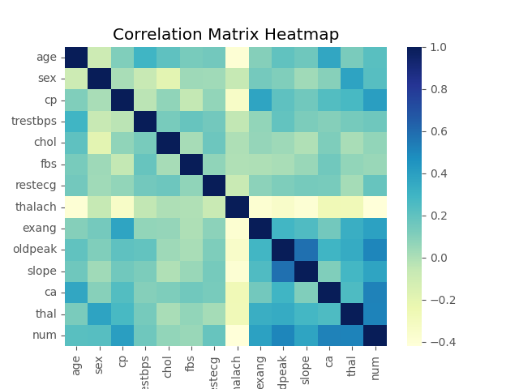
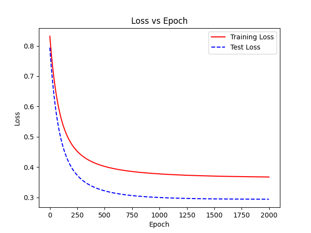

# Heart Disease Prediction with Logistic Regression
In this project, I have created my custom Logistic Regression algorithm from scratch using just numpy library. In my custom algorithm, it uses sigmoid activation function to calculate the predicted probability, and apply binary cross entropy loss function to calculate the loss of my model (how wrong my model's prediction is compared to the actual result). 
I have also applied L2 Ridge Regularization into my model to reduce the chance of overfitting happens, where my model performing well on training phase but poorly in testing phase due to it memorizing the training phase's prediction values. 
Additionally, I have followed Scikit-Learn's Logistic Regression model patterns and created my own functions, which are predict_proba() and predict() in my custom algorithm
Lastly, I have tested my custom algorithm against Scikit-Learn's Logistic Regression algorithm using the famous UCI Heart Disease dataset to showcase my algorithm's performance.

# 1. Where to obtain the dataset?
- You may download the dataset directly from UCI repository for machine learning via https://archive.ics.uci.edu/dataset/45/heart+disease

# 2. How to Preprocess the dataset?
- The data in the dataset has been preprocessed in advance, so there's no need to convert strings into numerical data, and you'll just have to make ? as NaN value

# 3. Dataset Walkthrough
- Based on this dataset, it consists of 13 variables and 1 target (result).\
- The target represents if the patient has heart disease, which consists of 0 (absence), and 1,2,3,4 (presence).\

# 3a) Dataset Attribute Breakdown
- Explanation of each variable and target is explained as below, with reference from https://archive.ics.uci.edu/dataset/45/heart+disease
1. age: The age of the patient (years)
2. sex: The sex of the patient (male/female)
3. cp: The chest pain category faced by the patient (1 - typical angina; 2 - atypical angina; 3 - non-anginal pain; 4 - asymptomatic)
4. trestbps: Resting Blood Pressure of the patient on admission to the hospital (mm Hg)
5. chol: Serum cholesterol level of the patient (mg/dl)
6. fbs: Check if the patient blood sugar level is > 120 mg/dl (0 - no; 1 - yes)
7. restecg: Resting Electrocardiographic Results (0 - Normal, 1 - ST-T abnormality, 2 - showing probable or definite left ventricular hypertrophy by Estes' criteria)
8. thalach: Maximum heart rate achieved
9. exang: Exercise induced angina (0 - no; 1 - yes)
10. oldpeak: ST depression induced by exercise relative to rest
11. slope: The slope of the peak exercise ST segment (1 - Upsloping; 2 - Flat; 3 - Downsloping)
12. ca: Number of major vessel (0 - 3) colored by flourosopy
13. thal: Thalassemia (3 - Normal; 6 - Fixed defect; 7 - Reversible defect)
14. num: diagnosis of heart disease (target; 0 - Absence; 1,2,3,4 - Presence)\

# 3b) Dataset target disclaimer
**In the actual dataset, the target(output) is multi-class with class 0 as absence of heart disease, and class 1,2,3,4 as presence of heart disease. Due to class imbalance in this dataset, it will perform poorly. To resolve this, we combined all class 1,2,3,4 under 1 class(category) which is presence of heart disease to improve the performance of the model in predicting heart disease.**


# 3c) Attribute type in the dataset
```
print(f"\nNumerical features in dataset: {df.select_dtypes(exclude='object').columns.tolist()}")
print(f"\nCategorical features in dataset: {df.select_dtypes(include='object').columns.tolist()}")
```
```
Numerical features in dataset: ['age', 'sex', 'cp', 'trestbps', 'chol', 'fbs', 'restecg', 'thalach', 'exang', 'oldpeak', 'slope', 'ca', 'thal', 'num']
Categorical features in dataset: []
```

# 3d) N/A checking and dropping
- We use Pandas library's isna().sum() to check the sum of NA values for each attributes in the dataset
```print(df.isna().sum())```
```
age         0
sex         0
cp          0
trestbps    0
chol        0
fbs         0
restecg     0
thalach     0
exang       0
oldpeak     0
slope       0
ca          4
thal        2
num         0
dtype: int64
```
- After we drop all NA values with Pandas, we check again the rows and columns of the dataset
```
Before dropping NA: (303, 14)
After dropping NA: (297, 14)
```

# 4. Exploratory Data Analysis
- In this dataset, we have plotted several graphs to analyze the relationship between the variables in the dataset, which are as belows:
1. Box plot for Resting Blood Pressure with outliers\

2. Box plot for Resting Blood Pressure without outliers (p < 95th quartile)]\

3. Box plot for Cholesterol with outliers\

4. Box plot for Cholesterol without outliers (5th quartile < p < 95th quartile)\

5. Box plot for Maximum Heart Rate with outliers\

6. Box plot for Maximum Heart Rate without outliers (5th quartile < p < 95th quartile)\

7. Scatterplot between age against heart disease results\

8. Correlation Matrix Heatmap\


# 5. Machine Learning Algorithm Selection
- In this dataset, we have chosen Logistic Regression as our algorithm model to train and test on the heart disease dataset
- This is because the target(output) of the dataset is a categorical value, with classes of 0-4 (adjusted to 0 and 1 later due to class imbalance problem), which makes the prediction task a classification problem more than a regression problem
- As a result, since our dataset poses a categorical problem, it is more suitable for us to use classification machine learning algorithms like Logistic Regression, Support Vector Machine (SVM), Decision Tree, and Random Forest

# 5a) Comparison between Linear vs Logistic ML Algorithms
- For Linear Regression, it takes in an input value and predict a continuous value output
**Linear Regression Formula Breakdown:**
$$
y = \theta_{1}x_{1}+\theta_{2}x_{2}+...+\theta_{n}x_{n} + b
$$
**Where:**\
y = Actual value\
x = Value for each feature\
$\theta_{n}$ = Weights for each feature (1-n)\
b = Bias
- The value of the target y, can be anywhere from 0 to ∞ (i.e. Predicted house prices: $2340000)

- On the other hand, for Logistic Regression, it is similar to Linear Regression, where it multiplies the weights with input X and add with bias to produce a predicted output y.
- However, it then passes the y value into an activation function like sigmoid, where the function maps the y value into a probabilistic output between 0 and 1.
- So instead of producing a continuous value like in Linear Regression, Logistic Regression produces a probabilistic prediction(proba) between 0 and 1 (i.e. 0.649324...)
- Thus, using Logistic Regression aligns with our goal in this dataset effectively, as the dataset's target is 0(no heart disease) and 1(has heart disease). By using Logistic Regression to predict a probability value, it shows the model's ability to estimate how likely the patient will get heart disease based on their clinical data. We then convert the probability into class labels by "rounding off" (if proba > 0.5, class label = 1 and vice versa).
- Logistic Regression Formula Breakdown:\
$$\frac{1}{1+e^{-(b_{0}+\theta_{1}x_{1}+\theta_{2}x_{2}+...+\theta_{m}x_{m})}}\= \frac{1}{1+e^{-z}}$$

**Where:**\
z = $y = \theta_{1}x_{1}+\theta_{2}x_{2}+...+\theta_{n}x_{n} + b$\
$\theta_{m}$ = Weights for mth column (mth feature)\
$x_{m}$ = Value for the mth column (mth feature)\
$b_{0}$ = Bias
- In short, even though Linear Regression and Logistic Regression falls under the same Linear Model Family, Linear Regression produces an actual continuous value(i.e. 400000) as prediction, while Logistic Regression produces a probabilistic value(i.e. 0.30) as prediction through sigmoid function.

# 5b) Use case between Continuous ML Algorithms and Categorical ML Algorithms
- In Continuous ML Models like Linear Regression, it is best used in scenario where it predicts an exact number/value.
- For example, House Prices(Actual: \$43000000 vs Predicted: \$4560000) and Student Grades(Actual: 76 vs Predicted: 63)
- In Categorical ML Models like Logistic Regression, it is best used in scenario where it provides the probabilistic value, then the value is round off to either category.
- For example, Scam Email Detection(Actual: 1(True) vs Predicted: 0.6934=1(True)) and our Heart Disease Prediction(Actual: 0(False) vs Predicted: 0.4331=0(False))

# 6. Outcome of the Model
# 6a) Custom Logistic Regression Model 
- In my custom model, I have set the learning rate to be 0.01, the Regularisation L2 Ridge penalty to be 0.0001, and epochs(iterations) to be 2000. Below is the result of the model's testing metrics against the dataset:
```
Epoch 1900: Training Loss: 0.3676 | Training Accuracy: 84.81% | Test Loss: 0.2940 | Test Accuracy: 83.33%
----------------------Metrics----------------------
Accuracy: 83.3333%
Precision: 0.8462
Recall: 0.7857
F1: 0.8148
ROC AUC: 0.9542
```


# 6b) Scikit-Learn's Logistic Regression Model
- In Scikit-Learn's Logistic Regression Model, I have set the solver to be lbfgs, which is the default optimization algorithm, and epochs(iterations) to be 2000. Below is the result of the model's testing metrics against the dataset:
```
----------------------Metrics----------------------
Accuracy: 83.3333%
Precision: 0.8348
Recall: 0.8304
F1: 0.8316
ROC AUC: 0.9498
```

# 7. Conclusion
In conclusion, the custom Logistic Regression model and Scikit-Learn's Logistic Regression Model have achieved similar performance in the adjusted binary-class UCI heart disease dataset, with an accuracy of 83.33% and ROC_AUC of 94-95%.
By adjusting the UCI heart disease dataset from multi-class(0-4) to binary class(0-1), it significantly boosts the performance of both models by removing the problem of class-imbalance, leading to bias and skewness from the model.
Furthermore, the close match in both model's performance has proved the custom model to be mathematically correct and properly optimized. Additionally, the use of L2 regularisation in the custom model has proved to reduce the risk of the model to overfit, as shown in the loss curve where the both training and testing loss are dropping steadily without indication of sudden rising up.
Overall, this project has successfully demonstrated a working proof-of-concept Logistic Regression from scratch using Numpy library, and rigorous mathematical formulas to compete with industrial-standard machine learning libraries like Scikit-Learn.
